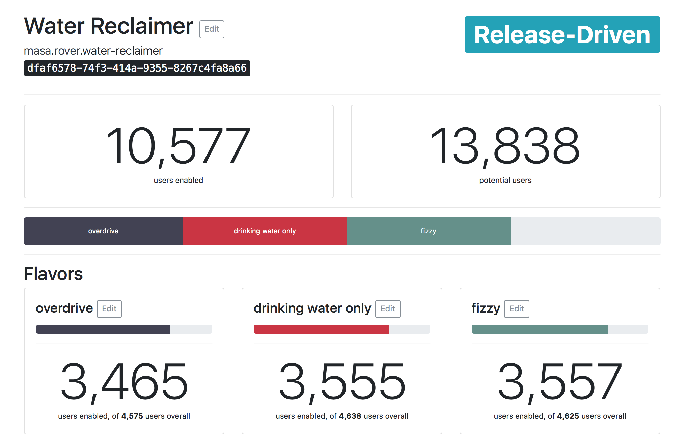

Ablator is a Functionality-Switching-Service that makes it easy for your app to roll out new
features in a controlled way, and to perform reliable A/B testing.
====================================================================================================

It works like this:

1. You define your app's switchable functionalities in ablator.
2. Your app asks ablator "Can I user X use Functionality Y?" and shows or hides the functionality
   as needed.
3. ablator takes care of slowly rolling out the feature in a way that you define.

As an administrator, you'll get a nice overview of what percentage of users has a functionality
enabled.

At the moment, ablator is in an early stage of development. The core functionality, especially
APIs for funtionality checking, is there, but there are a lot of improvements to be made. See the
road map below for a list of features that are planned for the future.

Owing to the early stage, you'll probably have to have some experience in hosting a Django
application to be able to use ablator right now. It is planned to mitigate this in the future by
offering a version in a Docker container, or even as a service in some distant point in the future.
However, ablator will stay open source, because open source is cool and helpful!

Getting Started
---------------

Ablator's top concept is the *App*. An *App* can have multiple *Functionalities*, which are
individual features of your application that you want to manage in ablator. Not all of your app's
features have to be present in ablator, only those you want to manage and roll out in a controlled
way.

A *Functionality* can have one or more *Flavors*. If only one *Flavor* is present, the
*Functionality* is a binary affair: Either your users have it enabled, or not. If multiple
*Flavors* are present, you can present your users different variants of the same feature, e.g. for
use in A/B or Red/Green testing.

Defining Switchable Functionalities
~~~~~~~~~~~~~~~~~~~~~~~~~~~~~~~~~~~

Right now, you'll have to configure ablator entirely from the Django admin interface. A proper
web interface will follow as soon as possible.

To start, define a new *App*, giving it a name and a slug. The name is for use in the web interface,
whereas the slug identifies the feature to the API and client libraries. Add a few *Functionalities*
to your new app -- each *Functionality* should describe a distinct feature of your app. Give your
*Functionality* one *Flavor* (named, e.g., "on") to use ablator as a simple on/off switch. Give it
more *Flavors* to randomly distribute your users between them.

Here are some examples for *Functionalities* and *Flavors*:

- an intro screen that pops up to inform users about your app (one *Flavor* named "on")
- a new settings tab (one *Flavor* named ``full-settings``, one named ``simple-settings``)
- your app's new color scheme (*Flavors* named ``red``, ``green``, and ``blue``)

Rollout and Releases
~~~~~~~~~~~~~~~~~~~~

To roll out your new *Functionality*, you need to set a release strategy. Possible options are

:Recall Functionality:
    Oops, you made a mistake. All users will have that functionality revoked, even those who had it
    enabled in some form before.

:Pause Roll Out:
    All new users will get the functionality disabled, but users who already had the functionality
    will get to keep it.

:Enable Globally:
    Once you're satisfied the functionality works as intended and doesn't overwhelm your servers,
    use this roll out strategy to enable it for all users.

:As defined by Releases:
    During the rolling out process, it makes sense to have more fine-grained control over how your
    *Functionality* is enabled. Add one or more *Release* objects to your *Functionality* to
    configure those more fine-grained options.

Accessing the Ablator API
~~~~~~~~~~~~~~~~~~~~~~~~~

Road Map
--------

Client Libraries
~~~~~~~~~~~~~~~~

- Python
- Swift
- Your favourite language? Open an issue!

Performance
~~~~~~~~~~~

Web UI
~~~~~~

Logging
~~~~~~~

Dockerization
~~~~~~~~~~~~~

More Roll Out Strategies
~~~~~~~~~~~~~~~~~~~~~~~~

Test Coverage
~~~~~~~~~~~~~

Ablator As A Service
~~~~~~~~~~~~~~~~~~~~

Maybe some day, if people are interested.

Help Out and Code of Conduct
----------------------------

We'd like to encourage your feature requests, bug reports and pull requests. Please note that a
Code of Conduct as described in `CODE_OF_CONDUCT.md` applies to this project. In short, be friendly,
welcoming, considerate, respectful, and be careful in the words that you choose please. If you think
you've witnessed a CoC violation, please contact Daniel at winsmith@winsmith.de .
